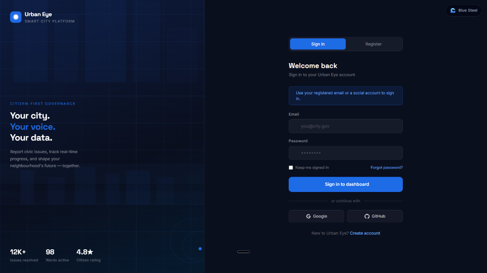
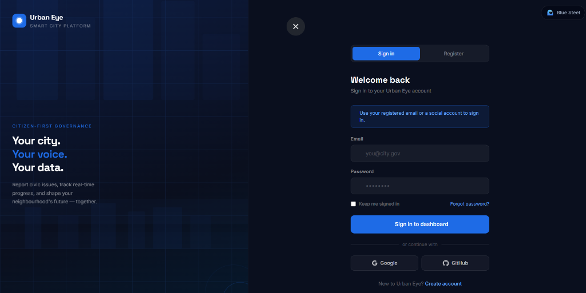
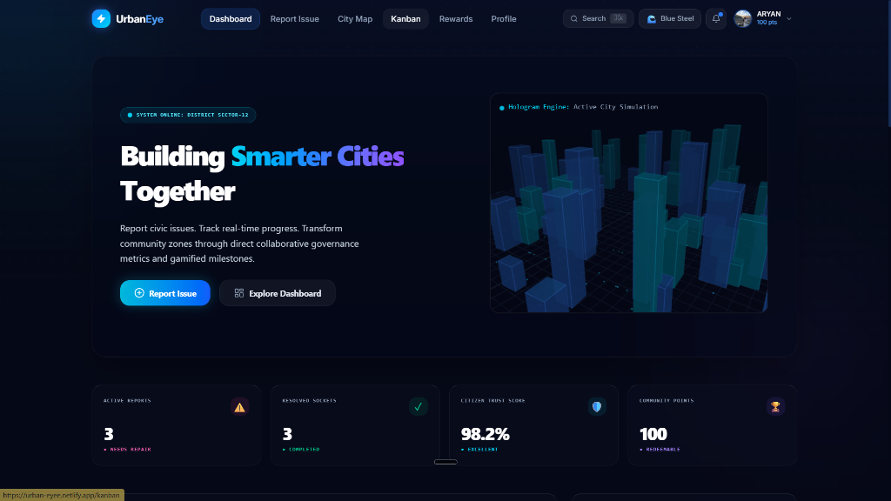
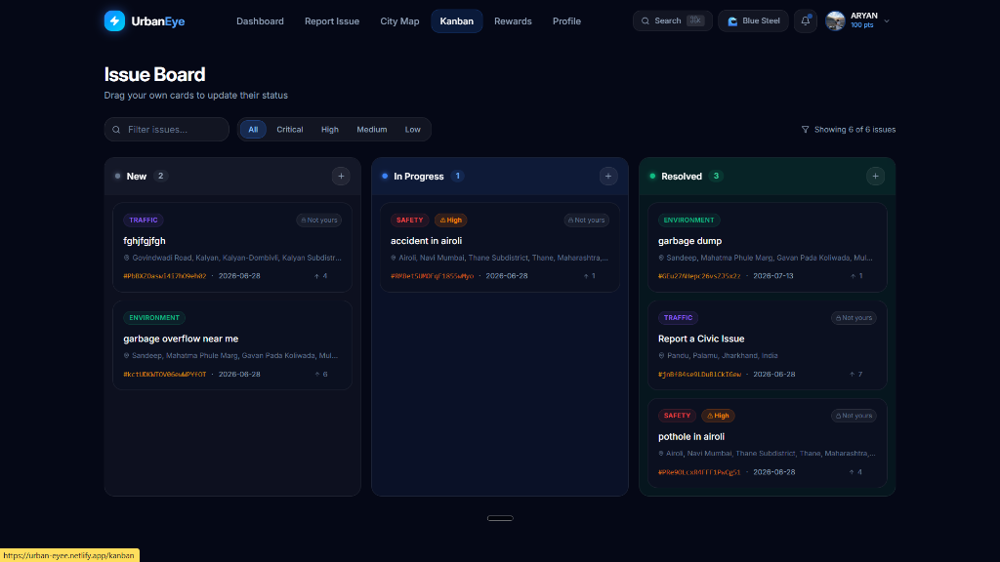
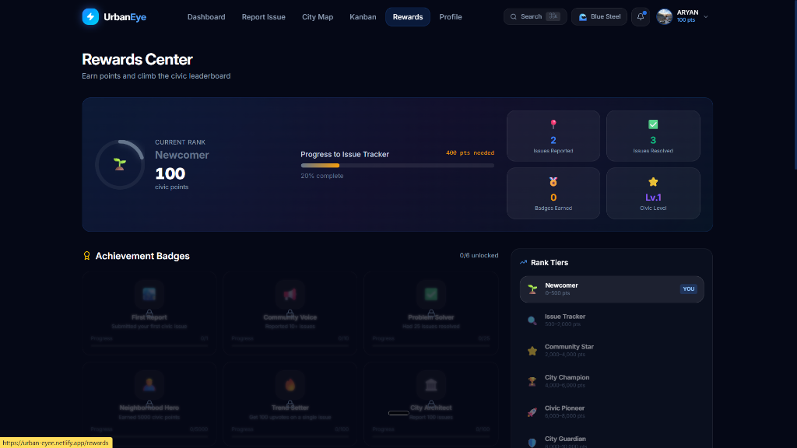

# 🌆 Urban Eye – Smart Civic Issue Reporting Platform

> **Your city. Your voice. Your data.**
>
> Empowering citizens to report and track civic issues efficiently with a modern, interactive web platform.


---

## 📖 Overview

Urban Eye is a modern civic engagement platform that bridges the gap between citizens and local authorities. Users can report issues like potholes, garbage accumulation, broken streetlights, water leakage, and more through an intuitive interface while tracking their resolution status in real time.

The goal is to make city issue reporting transparent, fast, and accessible for everyone.

---

## 📸 Screenshots

### 🔐 Landing & Authentication



### 📊 Dashboard


### 📋 Kanban Issue Board


### 🏆 Rewards Center


---

## ✨ Features

- 📍 **Issue Reporting** — Report civic issues with location tagging, categories (Traffic, Safety, Environment), and priority levels
- 🗺️ **Interactive City Map** — Geospatial visualization of reported issues across the city
- 📸 **Image Upload** — Attach photos when reporting issues
- 📊 **Interactive Dashboard** — Real-time stats on active reports, resolved issues, citizen trust score, and community points
- 📋 **Kanban Board** — Drag-and-drop issue tracking across New, In Progress, and Resolved columns
- 🔍 **Smart Filtering** — Filter reports by category, status, and priority
- 🏆 **Rewards & Gamification** — Earn civic points, unlock achievement badges, and climb rank tiers from Newcomer to City Guardian
- 👥 **Community Feed** — Stay updated with civic activity
- 🔐 **User Authentication** — Sign in with Google or GitHub
- 📱 **Fully Responsive** — Beautiful on every device
- ⚡ **Fast & Modern UI** — Sleek dark-themed interface with smooth animations

---

## 🛠️ Tech Stack

### Frontend

- React + TypeScript
- Vite
- Tailwind CSS / PostCSS
- React Router
- Context API

### Backend (Planned)

- Firebase Authentication
- Firestore Database
- Firebase Storage

### Deployment

- Netlify

---

## 📂 Project Structure

```
Urban-Eye/
│
├── public/
├── src/
│   ├── components/
│   ├── pages/
│   ├── assets/
│   ├── context/
│   ├── hooks/
│   ├── utils/
│   └── App.jsx
│
├── package.json
└── README.md
```

---

## 🚀 Getting Started

### Prerequisites

- [Node.js](https://nodejs.org/) (v18+)
- npm

### Clone the Repository

```bash
git clone https://github.com/paraoxxx6969/Urban-eye.git
cd Urban-eye
```

### Install dependencies

```bash
npm install
```

### Start Development Server

```bash
npm run dev
```

Open: `http://localhost:5173`

---

## 🎯 Future Improvements

- 🤖 AI-powered issue detection
- 🌐 Multi-language support
- 🔔 Push notifications
- 📱 Mobile application
- 🛰️ Live GPS tracking
- 📈 Analytics Dashboard
- 🏛️ Government Admin Panel

---

## 💡 Why Urban Eye?

Traditional civic complaint systems are often slow and difficult to use.

Urban Eye aims to create a smarter ecosystem where citizens can:

- Report problems quickly
- Track complaint progress
- Increase transparency
- Encourage community participation
- Improve communication with local authorities

---

## 🤝 Contributing

Contributions are always welcome!

1. Fork this repository
2. Create a feature branch
3. Commit your changes
4. Push your branch
5. Open a Pull Request

---

## 📄 License

This project is licensed under the MIT License.

---

## 👨‍💻 Developer

**Aryan Rawat**

- 💼 Aspiring Full Stack Developer
- 🌐 Passionate about Web Development & UI/UX
- 🚀 Open to Freelance Projects, Internships, and Collaborations

If you like this project, consider giving it a ⭐ on GitHub!

---

## ❤️ Support

If you found this project helpful:

⭐ Star the repository

🍴 Fork the project

📢 Share it with others
